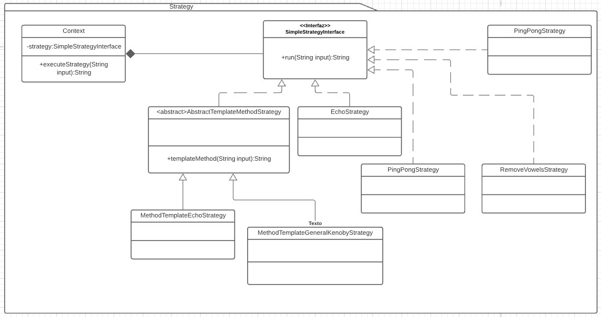

# Strategy
Es un patron de comportamiento (behavioral). [Link descripcion](https://sourcemaking.com/design_patterns/strategy)

Este patrón se utiliza para abstraer la implementación de lógica de algoritmos con un objetivo común a través  de varias implementaciones concretas derivadas de clases abstractas (con un template method) dichas clases utilizan una interfaz común conocida por el cliente para que puedan ser intercambiables en runtime.

¿Por qué éxiste el context, cual es su función?

## Diagrame de clases

## SOLID
* Single responsibility

El context tiene la responsabilidad de ejecutar el metodo run del strategy, y la strategy tiene una responsabilidad unica definida. Este principio se cumple

* Open/Close principle

Si necesitamos que el context funcione diferente puede perfectamente heredarse (incluso crear un context abstracto y sus implementaciones concretas para ganar polimorfismo) Los objetos strategy se apoyan a su vez en la herencia o implementación de interfaces por lo que este principio también se cumple.

* Liskov substitution

Los strategy no tienen problema en comportarse como su padre, de hecho así funcionan en esta demo. El context puede ser un poco más sensible pero no veo razón para que context hijos del context de este ejemplo no puedan sustituir el uso del context padre, supongo que depende de la habilidad de crear un context limpio y reusable. Este principio no entraría en conflicto con el patron.

* Interface segregation

El context podría crecer bastante... pero como los principios anteriores no debería haber problema, de hecho a simple vista no habría razón para tener un supercontexto, una implementación reducida con una sola responsabilidad bastaría.
